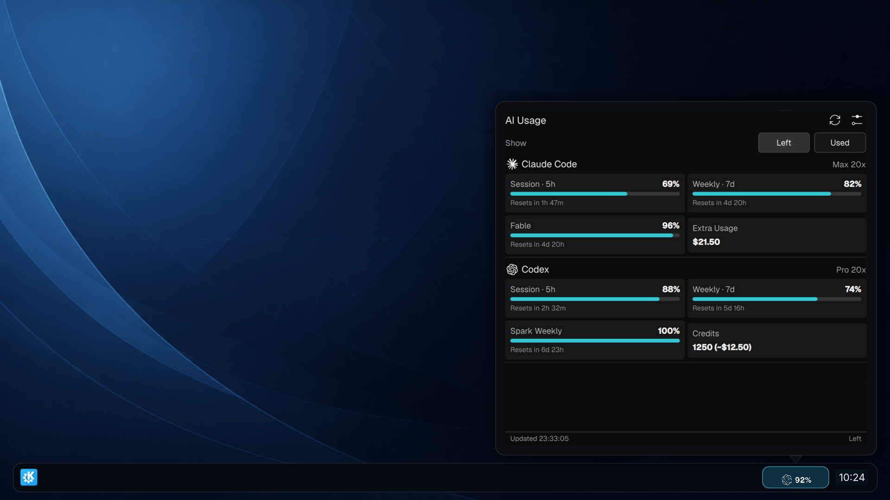
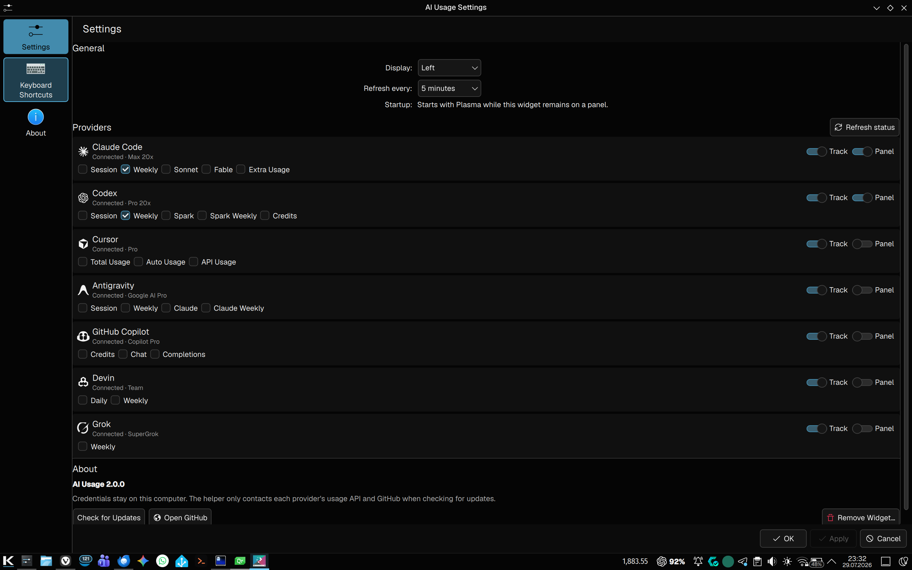

<div align="center">

# AI Usage — KDE Plasma widget

**AI coding subscription usage, native in your Plasma panel.**

[](https://kde.org/plasma-desktop/)
[](https://www.python.org/)

[](LICENSE)

<br>



</div>

AI Usage is a Plasma 6 panel widget for the same seven providers supported by
the macOS AI Usage menubar app:

- Claude Code
- Codex
- Cursor
- Antigravity
- GitHub Copilot
- Devin
- Grok

It shows each available quota, plan, reset time, extra usage or credits. The
panel can show any combination of providers and metrics. Both the popup and
panel support **Left** and **Used** display modes.

## Features

- Detects installed tools through the Plasma login environment, CLI names, and
  Linux/XDG data locations.
- Contacts only providers that are both installed and tracked.
- Keeps successful readings in Plasma session memory when a temporary or
  rate-limit error occurs; usage history is never written to disk.
- Refreshes rotating OAuth credentials back to their exact source with
  compare-before-write protection.
- Uses Linux Secret Service through `secret-tool` without placing secrets in
  process arguments.
- Checks GitHub Releases on launch, every 24 hours, or manually from Settings.
- Uses Plasma's standard configuration dialog and starts with Plasma while it
  remains on a panel.

Fresh installs track all providers, show Claude Code and Codex in the panel,
select Weekly for each, display usage left, and refresh every five minutes.

## Configure every provider

Track only the tools you use, choose which providers appear in the Plasma
panel, and select one or more metrics per provider.



## Install

```bash
./scripts/install.sh --restart-plasma
```

The script installs the dependency-free Python helper into the user Python
site, installs or upgrades the plasmoid, removes the obsolete v1 retry cache,
and optionally reloads Plasma.

Then right-click the panel, choose **Add Widgets…**, search for **AI Usage**,
and add it. The first 2.0 launch opens Settings once.

Manual installation remains available:

```bash
python3 -m pip install --user --break-system-packages .
kpackagetool6 -t Plasma/Applet -i plasmoid
```

Use `-u plasmoid` instead of `-i` when the package is already installed.

## Helper CLI

```bash
ai-usage-kde --json
ai-usage-kde --providers=claude,codex
ai-usage-kde --catalog
ai-usage-kde --check-update
```

The JSON v2 response includes the provider catalog, detected provider IDs,
status/failure classification, available metrics, quota windows, billing
usage, reset/retry times, and no credential data.

## Requirements

- KDE Plasma 6 and Qt 6
- Python 3.11 or newer; standard library only
- `secret-tool` when a provider stores its session in Linux Secret Service

## Privacy

No tokens, credential fingerprints, raw API responses, local transcripts, or
usage history are printed or cached. Antigravity's derived access-token cache
is the only authentication cache created by AI Usage; it is stored with mode
`0600` under `$XDG_CACHE_HOME/ai-usage-kde` and keyed to a one-way refresh-token
fingerprint. See [Privacy](docs/privacy.md) and
[Provider contracts](docs/provider-contracts.md).

## Development

```bash
python -m venv .venv
source .venv/bin/activate
python -m pip install -e ".[test]"
QT_QPA_PLATFORM=offscreen python -m pytest
python3 -m compileall -q src
qmllint plasmoid/contents/ui/*.qml
QT_QPA_PLATFORM=offscreen /usr/lib/qt6/bin/qmltestrunner -input tests/qml
```

## License

[MIT](LICENSE)
